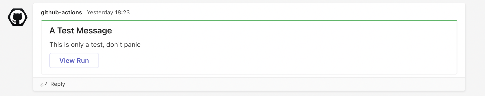
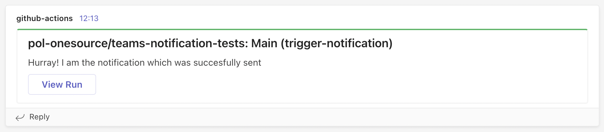

# github-action-notify-teams
A custom GitHub Action with publishes a message card to a Microsoft Teams channel via an incoming webhook connector

## Usage

This action can be invoked as follows:

```
  notify-teams:
    uses: chrisdleech-pol/github-action-notify-teams@<version>
    with:
      TEAMS_URI: <URI of Microsoft Teams incoming webhook>
      TEAMS_MSG_TITLE: <title of the message>
      TEAMS_MSG_SUMMARY: <summary of the message>
      TEAMS_MSG_TYPE: <type: 'info', 'success', 'failure'>
```

For example, an invocation as follows:

```
  notify-teams:
    uses: chrisdleech-pol/github-action-notify-teams@<version>
    with:
      TEAMS_URI: <URI of Microsoft Teams incoming webhook>
      TEAMS_MSG_TITLE: 'A Test Message'
      TEAMS_MSG_SUMMARY: 'This is only a test, don't panic!'
      TEAMS_MSG_TYPE: 'success'
```

Will result in a message card as follows:



The View Run button links directly to the related GitHub Action Run page.

## Advanced Usage

### Passing GitHub vars to the job

You may want to pass github vars to the jobs to provide better context. You can do so as follows:

```
name: 'Main'

on:
  push:
    branches:
      - 'master'

jobs:
  trigger-notification:
    name: 'Trigger a test notification to teams'
    runs-on: ubuntu-latest
    steps:
    - name: Send Teams Notification
      uses: chrisdleech-pol/github-action-notify-teams@<version>
      with: 
        TEAMS_URI: <URI of Microsoft Teams incoming webhook>
        TEAMS_MSG_TITLE: "${{ github.repository }}: ${{ github.workflow }} (${{ github.job }})"
        TEAMS_MSG_SUMMARY: "Hurray! I am the notification which was succesfully sent"
        TEAMS_MSG_TYPE: "success"
```

For TEAMS_MSG_TITLE input, this will pass the name of the repository and the workflow and job ID to the notification card, resulting in a card as follows:



### Using for failed jobs

To trigger a notification when a job has failed, simple add the following the job config:

`if: ${{ failure() }}`

This will trigger the notification on failure of any preceeding step in the job 

Note: The colour theme of the message card is a result of the teams-msg-type input value:

| Type        | Colour Theme  |
| ----------- | -----------   |
| info        | :blue_heart:  |
| success     | :green_heart: |
| failure     | :heart:       |
